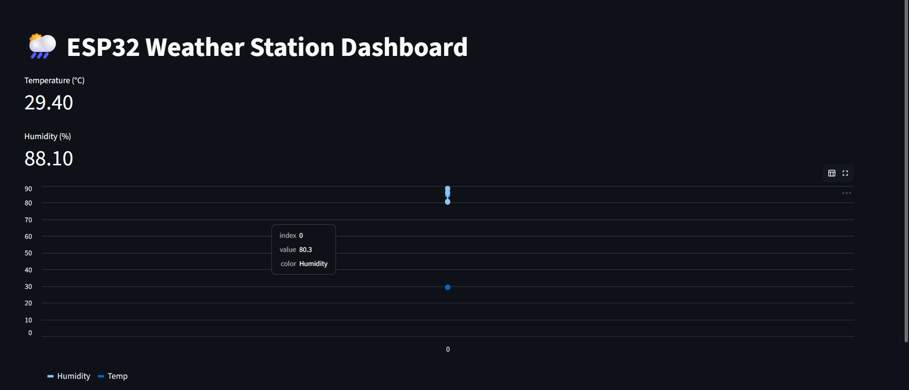

# 🌦️ ESP32 Weather Station

This project reads **temperature and humidity using DHT11 + ESP32** and displays it on a **Streamlit web dashboard**.

---

## 🧰 Components

- ESP32
- DHT11 Sensor
- 10kΩ Resistor
- Jumper wires

---

## 🔌 Connections

- VCC → 3.3V  
- GND → GND  
- DATA → GPIO21  
- 10k resistor between VCC and DATA  

---

## 💻 Arduino Setup

### Libraries Required

- DHT sensor library (Adafruit)
- Adafruit Unified Sensor

### Output Format

ESP32 must send:
    30.00,65.00

---

## 🐍 Python Setup

### Install Libraries
Python Libraries

Install using:
    pip install streamlit pyserial pandas

Libraries used:
• streamlit
• pyserial
• pandas

---

## 🐍 Streamlit Dashboard Setup

Run the dashboard using:
     python -m streamlit run app.py

---

## 📸 Screenshot

---

## ⚠️ Notes

- Close Arduino Serial Monitor before running Python  
- Check correct COM port  
- DHT11 updates every ~2 seconds  

---

## 📁 Project Structure
esp-projects/
└── weather station/
├── app.py
└── DHTSENSORcode/
